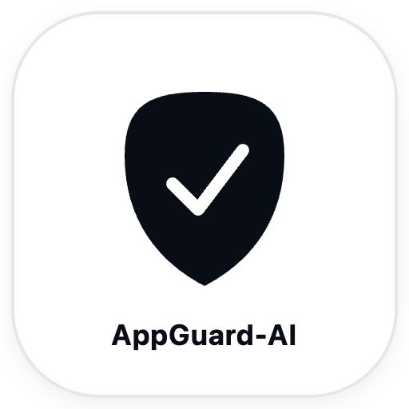

<div align="center">
  
  <h1>AppGuard</h1>
  <p><strong>移动互联网应用程序隐私合规审计与端云协同分析系统 (v1.10)</strong></p>
  <p>
    <a href="https://opensource.org/licenses/Apache-2.0"></a>
    <a href="https://www.python.org/"></a>
    <a href="https://developer.android.com"></a>
    <a href="https://www.miit.gov.cn/"></a>
    <a href="https://www.cac.gov.cn/"></a>
    <a href="http://taf.org.cn/"></a>
  </p>
</div>

**AppGuard (v1.10)** 是一套面向移动互联网应用程序（Android APP）的高性能、动静双轨隐私合规审计与端云协同自动化分析系统。系统深度对标《中华人民共和国个人信息保护法》、工业和信息化部《关于进一步提升移动互联网应用服务能力的通知》（**工信部信管函〔2023〕26号**）、国家四部委《常见类型移动互联网应用程序必要个人信息范围规定》（**39类国标**）及电信终端产业协会 **T/TAF 077.1-2022** 防误触规范。

针对传统合规工具面临的**“机械扫描 API 存在性导致大量误报、动态沙箱依赖 Root 易被对抗破防、违规取证与主营业务场景割裂”**等行业治理痛点，AppGuard 创新融合 **场景化合规审计智能体 (Compliance Agent)** 与 **Android 16 免 Root 硬件探针动态沙箱**，实现从“代码存在性检查”向“业务因果链溯源与精准合规裁决”的跨越式升级。

---

## 🌟 核心技术亮点 (Key Innovations)

### 🤖 1. 合规审计智能体 (Compliance Agent · AI+ Context 场景化因果研判)
传统静态扫描工具最大的痼疾在于“机械扫描 API 签名匹配”。例如，浏览器具备下载文件能力（调用系统 `DownloadManager`）或在前台由用户主动点击搜索框粘贴网址（访问剪贴板），在传统扫描器中往往被一刀切扣分为“诱导静默下载”或“违规窃取剪贴板”。

AppGuard v1.10 引入 **AI+ 合规审计智能体**，彻底解决机械误报问题：
- **国家四部委 39 类国标场景基准**：内置网信办、工信部、公安部、市监局联合发布的《常见类型移动互联网应用程序必要个人信息范围规定》全量 39 类应用规范库，依据应用法定业务范围进行基线约束。
- **DEX 字节码调用位置深层反向因果溯源**：深入多 DEX 底层指令与跨组件交叉引用（XRef），反向提取 `caller_class::caller_method -> target_api` 物理调用点，穿透识别责任归属主体（应用自身主营模块 vs 第三方商业聚合 SDK）。
- **场景化裁决与合规豁免机制**：
  - **合理业务场景豁免回补**：如核实目标应用为浏览器或下载工具，其原生下载调度属于主营业务所必需，智能体依据四部委《规定》第 32 条给予全额场景豁免并回补得分（+5分）；
  - **前台交互降权优化**：对前台用户交互手势触发的剪贴板读取给予降权建议，并出具针对性防冷启动嗅探补丁；
  - **严重违规行为加重扣罚**：对开屏阶段无交互高频监听加速度计/陀螺仪、单机应用全盘扫描逃逸、非出行类应用越权常驻定位等严重背离主营功能的违规行为，坚决执行双向加重扣罚（如 -2 ~ -3分），杜绝合规洗白。
- **真实性与审计透明度规范 (Audit Integrity)**：
  - **置信度模式严格区分**：在线大模型研判输出真实语义置信度（如 95.8%）；离线推导明确标注为“四部委 39 类国标确定性规则推导（DETERMINISTIC_RULES）”，彻底废除离线统计概率伪装；
  - **申报品类与法理责任边界**：报告显式标注应用品类为“申报主营业务品类（开发者自述/测试指定）”，并在报告末尾附带严谨的存证效力与法律责任边界声明；
  - **CLI 与 Web 报告引擎 100% 统一**：CLI 命令行与 Web 控制台统一接入 `compliance_agent` 与单文件 HTML 报告生成引擎，确保各端产出的法证存证完全一致。
- **一键品类智能研判**：支持在控制台主动点击「请求 Agent 自动分析类别和说明」，秒级深度推断目标应用国标类别、主营业务画像与适用的法规条文。
- **双驱动混合推理架构**：
  - **在线主流大模型**：深度支持 DeepSeek V3、Kimi、GLM-4 及 OpenAI 兼容协议大模型，支持 API 连通性实时自检与模型列表动态探测拉取；
  - **0ms 离线确定性专家引擎**：内置四部委 39 类国标知识图谱与因果判定规则，无网络或无 API Key 场景下 0ms 自动平滑降级，确保 100% 审计可用性。
- **法理意见书与可落地代码级 Patch**：输出权威法律条文依据（个保法第5/17条、工信部26号文）、调用成因深度剖析，以及开箱即用的 Java/Kotlin 合规整改代码。

---

### ⚡ 2. 免 Root 硬件探针动态沙箱 (Dynamic Sandbox Probe · Android 16 端云协同)
- **量产真机免 Root 硬件探针**：利用 Android 底层 `AppOps` 审计探针与系统运行日志（Logcat），完全无需破解刷机、无需修改系统镜像，在真实 Android 8.0 ~ 16.0 商业量产机上稳定取证，天然免疫各类应用加固反 Root/反调试检测。
- **真实 AppOps 权限时序差分**：对比应用启动前后的权限调用基线快照与运行时差分，精准捕获隐私协议同意前的静默越界索权、隐秘数据读取等现行违规动作。
- **开屏“摇一摇”高频传感器监听取证**：对标电信终端产业协会 **T/TAF 077.1-2022** 规范，监控加速度计与陀螺仪的监听器注册事件，精准捕获无滤波防误触的过激跳转风险。
- **端侧轻量靶向抽取 (Targeted Payload Streaming)**：通过端侧设备内直接流式解构提取 `classes*.dex` 与 `AndroidManifest.xml`，百兆以上大型应用（如支付宝、菜鸟等）无需回传庞大资源文件，秒级抽离就绪，彻底解决端云传输卡顿。
- **严格单调递增的证据链时序 (Monotonic Evidence Timeline)**：重构证据链时钟生成器，确保所有动态法证记录严格单调递增，杜绝时间戳倒流或乱序。
- **探针生命周期安全闭环**：支持“临时静默推装 ➔ 沙箱探针无侵入取证 ➔ 零残留自动彻底卸载（Purged）”，保障测试真机长期清洁纯净。

---

### 🔍 3. Dalvik 字节码逆向与 12 大工信部专项红线矩阵 (Static Bytecode Engine)
- **多 DEX 完整语法反编译**：精准解析 `AndroidManifest.xml` (AXML)、多 DEX 字节码及资源索引表，规避 Multidex 漏检。
- **敏感 API 调用链定位**：精准反编译定位设备标识（IMEI/OAID/MAC）、地理位置、通讯录、剪贴板、传感器等敏感 API 的调用点。
- **50+ 款主流商业 SDK 指纹识别**：覆盖穿山甲、腾讯优量汇、快手联盟、极光、个推、友盟、高德、百度、微信 OpenSDK、支付宝、阿里云、HMS 等 54 款高频商业 SDK 的特征指纹。
- **12 项合规红线规则库**：内置依据工信部信管函〔2020〕164号、工信部26号文及推荐性国标 GB/T 35273-2020 构建的合规审计规则库。

---

### 📊 4. 动静双轨融合与四维健康度雷达 (Dual-Track Fusion & WCI Radar)
- **动静互验消歧**：结合静态代码“存在性”与动态沙箱“发生性”，避免静态“包含 SDK 但运行时未调用”造成的误报，同时弥补纯动态分析无法全路径覆盖的盲区。
- **100 分制四维合规健康度雷达 (WCI)**：
  - **权限最小化 (20%)**：危险权限按需申请、杜绝冷启动一次性强制全量索权。
  - **数据收集透明度 (25%)**：明示收集目的、敏感隐私数据访问前置获得用户明示同意。
  - **行为合规度 (35%)**：后台静默访问拦截、摇一摇防误触跳转治理、自启动关联唤醒抑制。
  - **SDK 治理度 (20%)**：第三方 SDK 共享与合规声明、非必要组件剥离与责任穿透。

---

### 💻 5. Apple 级液态微晶毛玻璃控制台 (Apple Fluid Glass UI)
- **极致视觉体验**：采用高拟真微晶液态毛玻璃质感与精细交互动效，深度适配系统原生浅色 / 深色外观模式。
- **USB ADB 热插拔自适应感知**：支持双通道灵活输入：
  - **通道 A（APK 拖拽上传）**：支持本地 APK 拖拽，快速解构并由端云沙箱执行自动化检验；
  - **通道 B（真机即插即测）**：通过 USB 连接真实 Android 设备，自动枚举设备已安装应用并进行靶向分析。
- **科学耗时预期与提示**：明确标注基准预估耗时针对无 Agent 常规机检，若开启 Agent 深度分析，耗时由大模型推理与网络响应决定，拒绝模糊承诺。

---

### 📄 6. 单文件高保真合规诊断与技术存证报告 (Compliance Report Generator)
- 独立单文件离线 HTML 报告，无需依赖外部服务器或在线 CDN。
- 包含被测应用 SHA-256 唯一指纹哈希存证、法规范号溯源、机检事实快照与 Agent 场景化法理意见书。
- 逐项附带工业级合规代码修复方案（如 TAF-077 摇一摇防误触代理类、PhotoPicker 替代全盘存储扫描等），直接赋能开发者自查自纠。

---

## 📐 系统架构与数据流 (System Architecture)

```text
┌────────────────────────────────────────────────────────────────────────────────────────┐
│                   AppGuard Web Console (Apple Fluid Glass UI · v1.10)                   │
│   [Channel A: APK Drag & Drop]              [Channel B: Real-Device ADB Probe]         │
│   [Agent Config: DeepSeek / Kimi / GLM]     [One-Click 39-Category Auto-Inference]    │
└───────────────────────────────────────────┬────────────────────────────────────────────┘
                                            │ REST API / JSON Streams
┌───────────────────────────────────────────▼────────────────────────────────────────────┐
│                    AppGuard Core Dispatcher & Broker (server.py)                       │
│   - Real Device Topology Auto-Detection     - Channel A/B Pipeline Orchestration       │
│   - Targeted Payload Extraction Streamer    - Dual-Track Arbitration Engine            │
└───────────────────┬────────────────────────────────┬───────────────────────────────────┘
                    │                                │
┌───────────────────▼──────────────┐   ┌─────────────▼───────────────────┐
│   Static Bytecode & XRef Engine  │   │     Dynamic Sandbox Runner      │
│   (app_guard_scanner.py)         │   │     (sandbox_runner.py)         │
│ ├─ AXML/Manifest Parser          │   │ ├─ Non-Root AppOps Probe Engine │
│ ├─ Multi-DEX CallGraph & XRef    │   │ ├─ AppOps Snapshot Diff Probe   │
│ ├─ 50+ SDK Fingerprint Matcher   │   │ ├─ Logcat System Event Sniffer  │
│ └─ MIIT 12-Redline Rule Engine   │   │ └─ Monotonic Timeline Synthesizer│
└───────────────────┬──────────────┘   └─────────────┬───────────────────┘
                    │                                │
                    └────────────────┬───────────────┘
                                     │ Machine Evidence & Findings
┌────────────────────────────────────▼───────────────────────────────────────────────────┐
│                  Compliance Agent · Context Reasoning Engine                           │
│                             (compliance_agent.py)                                      │
│ ├─ 39-Category Statutory Law Mapper (四部委39类规定必要信息基线)                        │
│ ├─ DEX Call Location Tracing (classes::methods -> target_api 穿透因果)                 │
│ ├─ Contextual Exemption & Score Adjustment (业务必需豁免 / 违背最小必要惩治)           │
│ └─ Dual Engine: Online LLMs (DeepSeek/Kimi/GLM) + 0ms Deterministic Heuristic Engine   │
└────────────────────────────────────┬───────────────────────────────────────────────────┘
                                     │ Final Verified Audit Payload
┌────────────────────────────────────▼───────────────────────────────────────────────────┐
│              Compliance Diagnostic & Evidence Report Generator                         │
│                    (report_generator.py -> outputs/*.html)                             │
└────────────────────────────────────────────────────────────────────────────────────────┘
```

---

## 📋 12 大工信部红线审计矩阵 (MIIT Compliance Matrix)

| 规则编号 | 审计项名称 | 监管法规依据 | 检测模式 | Agent 研判能力 |
| :--- | :--- | :--- | :--- | :--- |
| `MIIT-01` | 私自收集个人信息 | 《个人信息保护法》第13条 / 工信部26号文 | 静态 XRef + 动态 AppOps | 校验是否具备用户明示授权链路 |
| `MIIT-02` | 超范围收集个人信息 | 四部委《必要个人信息范围规定》/ 工信部26号文 | 静态 Manifest + 动态访问 | 对标 39 类国标最小必要基线 |
| `MIIT-03` | 违规使用个人信息 | 《个人信息保护法》第17条 / 工信部26号文 | 静态调用链分析 | 校验目的外利用与超期留存 |
| `MIIT-04` | 开屏“摇一摇”高频监听与误触跳转 | T/TAF 077.1-2022 / 工信部26号文 第十条 | 动态传感器探针 + 静态 XRef | 非游戏类开屏监听坚决严惩维持扣分 |
| `MIIT-05` | 欺骗误导强迫用户 | 工信部信管函〔2023〕26号 第八条 | 静态 Manifest + 动态模拟 | 甄别诱导式交互与阻碍注销 |
| `MIIT-06` | 诱导点击与静默下载安装 APK | 工信部信管函〔2023〕26号 第五条 | 静态 DownloadManager 检索 | 识别浏览器主营业务并给予豁免 |
| `MIIT-07` | 应用频繁自启动和关联唤醒 | 工信部信管函〔2023〕26号 第九条 | 静态广播接收器 + 动态探针 | 识别协同推送通道与守护进程滥用 |
| `MIIT-08` | 频繁索取权限 / 权限滥用 | 工信部信管函〔2023〕26号 第七条 | 静态声明 + 动态频度统计 | 评估弹窗频率与业务相关性 |
| `MIIT-09` | 强制、频繁、过度索取权限 | 工信部信管函〔2020〕164号 / 26号文 | 静态 + 动态联合裁定 | 检查权限拒绝后是否闪退或频繁弹窗 |
| `MIIT-10` | 隐蔽后台读取剪贴板 | 《个人信息保护法》/ 工信部26号文 第七条 | 静态 XRef + 动态 AppOps | 区分冷启动静默嗅探与前台交互粘贴 |
| `MIIT-11` | 无感知录音与麦克风偷跑 | 《个人信息保护法》第28条（敏感个人信息） | 动态 AppOps 静默录音监测 | 校验是否存在前台录音标识与明示授权 |
| `MIIT-12` | 偷拍与后台相机隐秘调用 | 《个人信息保护法》第28条（敏感个人信息） | 动态 AppOps 摄像头监测 | 校验是否有前台预览与拍照显式动作 |

---

## 🚀 快速开始 (Quick Start)

### 1. 环境依赖
- **操作系统**：macOS / Linux / Windows
- **Python 版本**：Python 3.9+
- **Android 工具**：安装并配置好 `adb`（Android Debug Bridge）至系统环境变量 `PATH`
- **测试设备**（可选）：Android 8.0 ~ 16.0 真实设备（开启“开发者选项”及“USB 调试”）

### 2. 克隆与安装依赖
```bash
git clone https://github.com/congsmile/AppGuard.git
cd AppGuard

pip install -r requirements.txt
```

### 3. 启动审计服务
```bash
python server.py
```
服务默认启动在 `http://127.0.0.1:8080`。

### 4. 访问与测试
打开浏览器访问 `http://127.0.0.1:8080`：
- **通道 A（本地 APK 审计）**：直接将 `.apk` 安装包拖拽至页面上传区，系统将自动解构并执行动静双轨审计；
- **通道 B（真机即测）**：通过 USB 连接 Android 设备并信任调试授权，控制台将自动枚举设备已安装的第三方应用，点击目标应用即可一键启动真机探针测试；
- **Agent 场景研判配置**：点击顶部「配置 Agent」按钮，可按需填入 DeepSeek、Kimi、GLM 或自定义兼容大模型的 API Key，亦可直接使用系统内置的 0ms 离线专家引擎。

### 5. 运行自动化测试套件
```bash
python test_audit_engine.py
```
项目内置 21 项端到端单元与回归测试，覆盖字节码解析、时序单调性校验、命名空间防伪装、全量 39 类国标知识图谱、法定位置差分裁决、双向惩戒分值核算、Agent 场景化豁免、模型自动拉取与离线确定性降级机制等关键流程。

---

## 📂 仓库目录结构 (Repository Structure)

```text
AppGuard/
├── app_guard_scanner.py     # Dalvik 字节码逆向分析引擎与 12 大工信部合规红线规则库
├── compliance_agent.py      # 四部委 39 类国标场景化合规审计智能体 (Agent 双引擎推理)
├── gb_categories_39.json    # 国家四部委 39 类法定必要个人信息标准与合规 API/红线知识图谱
├── sandbox_runner.py        # Android 16 免 Root 动态沙箱硬件探针 (AppOps/时序证据链)
├── app_names_db.py          # 知名应用特征库与耗时动态预估模型
├── report_generator.py      # 高保真合规诊断存证 HTML 报告生成器
├── server.py                # 端云协同调度后端与 Web RESTful 控制接口
├── templates/
│   └── index.html           # Apple 微晶毛玻璃风格前端交互控制台
├── test_audit_engine.py     # 自动化合规审计与回归验证测试套件
├── requirements.txt         # 核心运行依赖清单
├── LICENSE                  # Apache 2.0 开源协议
└── README.md                # 项目全景架构与技术文档
```

---

## 📜 版本更新日志 (Release Notes)

### v1.10 (最新发布 · 规范性驱动与法定差分裁决引擎)
- **39 类法定标准知识库全面升级为核心推理驱动 (`gb_categories_39.json`)**：
  - 彻底清除 19 类 API 空数组：全部 40 个品类（39 法定类 + 1 个通用扩展）的 `legitimate_apis` 均填充真实的 Android 系统 API 签名，无任何空数组。
  - 40 类严格红线禁区（`strict_redlines`）全部针对本品类业务法定边界量身定制，彻底消除了模板化重复，实现 40 项逐类严格对齐。
  - 金融支付（第5类）与手机银行（第24类）合法 API 中严格剔除 `LocationManager`，精准对齐四部委法定必要个人信息清单。
- **地理位置法定差异化裁决闭环**：
  - 分支 A（13 类法定免收集个人信息品类）：违规定位判定为“法定免信息品类·违规定位加重扣罚 (-3分)”。
  - 分支 B（金融支付与手机银行类）：明确法定必要信息清单不含位置，以风控为由过度索取行踪轨迹判定为“超范围索取定位·加重扣罚 (-3分)”，彻底杜绝误豁免。
  - 分支 C（主营必需品类）：依据 `cat_info['legitimate_apis']` 研判，为出行导航类给予“主营功能必需·全额豁免扣分 (+5分)”，动态引用法定条款。
- **下载与剪贴板规则消除硬编码**：
  - 全链路解除对硬编码“第32条”与“第1条”的依赖，动态结合品类法定合法 API 与法条依据进行精准研判。
- **法律规范引用严谨化**：
  - 最小必要原则法规引用严格统一为《中华人民共和国个人信息保护法》**第六条**与第十七条（告知义务）。
- **离线降级与可观测性强化**：
  - 内置 `BUILTIN_MINIMAL_CATEGORIES` 兜底，确保在 JSON 知识库缺失时系统 100% 平滑运行；
  - 新增 `degrade_reason`，清晰透传“未配置大模型 API Key”与“在线请求超时/解析异常”，杜绝静默失败。
- **演练预置样本显式打标 (Audit Integrity)**：
  - Web 控制台与单文件 HTML 报告同步支持 `is_demo_sample` 徽章渲染（`[演练预置样本 · 供功能演示]`），严格区分预置演练样本与真实 APK 扫描，坚守学术与工程诚信底线。
- **自动化测试套件扩充至 21 项全覆盖**：
  - 新增法定位置差异化裁决测试、缺失知识库平滑降级测试等，21 项端到端单测 100% 全绿通过。

### v1.09 (最新发布 · 法定基线与审计诚信全面升级)
- **全量 39 类法定标准知识库落成 (`gb_categories_39.json`)**：
  - 严格依据国家网信办、工信部、公安部、市监总局四部委《常见类型移动互联网应用程序必要个人信息范围规定》（国信办秘字〔2021〕14号），全量收录全部 1~39 类法定必要个人信息标准及第 40 类通用扩展。
  - 彻底杜绝空壳字段：每类 100% 结构化包含法规条款项号、基本功能服务、必要信息边界、合法 API 与正当场景、严格红线禁区及标准申报画像。
  - 严格对标并明确界定 13 类法定免收集个人信息品类（女性健康、网络直播、在线影音、短视频、新闻资讯、运动健身、浏览器、输入法、安全管理、电子图书、拍摄美化、应用商店、实用工具）。
- **双向对称裁决算分机制 (Bidirectional Scoring & Penalty)**：
  - 突破传统工具“只能豁免加分、违规不加重”的局限，构建双向对称裁决算法。
  - 对严重背离申报主营功能、违背工信部红线的行为（如开屏无交互高频监听传感器进行“摇一摇”跳转、单机应用全盘扫描逃逸、非出行类应用越权常驻定位等），执行双向加重扣罚 (`score_penalty`)，使最终裁决分值真实下调，坚决杜绝“合规洗白”。
- **审计真实性与诚信边界升级 (Audit Integrity & Boundary)**：
  - 废除离线虚假置信度注水：离线推导模式明确标定为 `DETERMINISTIC_RULES`（四部委 39 类国标确定性规则推导），置信度明确标注为无统计概率伪装。
  - 申报透明度与存证效力保障：报告显式标明应用业务为“申报主营业务品类（开发者自述/测试指定）”，并在报告底部附带法律存证免责声明与责任边界。
- **CLI 命令行与 Web 控制台报告引擎 100% 统一**：
  - 命令行逆向分析器与 Web 控制台统一接入 `compliance_agent` 与高保真 HTML 存证报告引擎，保障双端产出报告风格、评判尺度与证据链完全一致。
- **全自动化测试套件扩充**：
  - 单测套件增至 19 项全覆盖，全部自动化测试稳定通过（包括 39 类图谱覆盖、13 类免信息判定、双向扣分与离线模式等）。

### v1.08 (智能体场景研判与端云沙箱增强)
- 首次引入 Compliance Agent 智能体场景化研判，支持 DeepSeek、Kimi、GLM 与自定义大模型端点。
- 适配 Android 16 免 Root 动态沙箱 AppOps 硬件探针与靶向流式抽取。
- 上线 Apple 液态微晶毛玻璃控制台与单文件高保真存证报告。

---

## ⚖️ 免责声明 (Disclaimer)

1. 本项目仅供应用开发者进行自身产品的个人信息保护合规自查、高校网络空间安全教学与科研以及安全工程技术研究使用。
2. 严禁利用本项目从事任何侵犯他人隐私权、反编译商业未授权软件牟利或从事恶意安全攻防活动。使用者需严格遵守《中华人民共和国网络安全法》《中华人民共和国数据安全法》及《中华人民共和国个人信息保护法》。

---

## 📄 开源许可证 (License)

本项目基于 [Apache-2.0 License](LICENSE) 协议开源。
